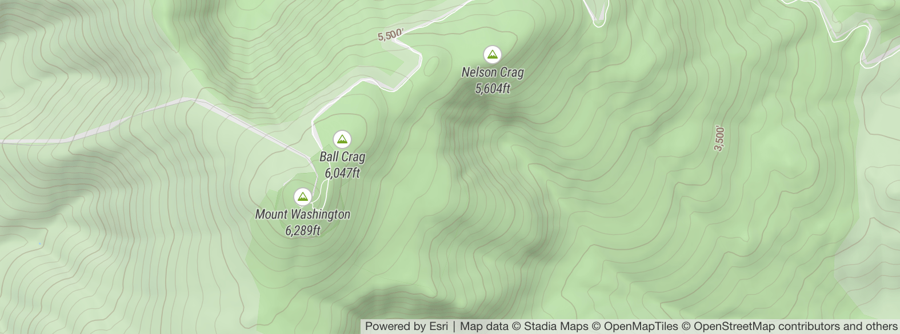

# Maplibre-contour

Maplibre-contour is a plugin to render contour lines in [Maplibre GL JS](https://github.com/maplibre/maplibre-gl-js) from `raster-dem` sources that powers the terrain mode for [onthegomap.com](https://onthegomap.com). It registers a vector tile provider using maplibre's `addProtocol` utility that fetches raster-dem tiles, generates contour lines, and returns an encoded vector tile each time a tile is requested.



[Live example](https://onthegomap.github.io/maplibre-contour) | [Code](./index.html)

To use it, import the [maplibre-contour](https://www.npmjs.com/package/maplibre-contour) package with a script tag:

```html
<script src="https://unpkg.com/maplibre-contour@0.0.2/dist/index.min.js"></script>
```

Or as an ES6 module: `npm add maplibre-contour`

```js
import mlcontour from "maplibre-contour";
```

Then to use, first create a `DemSource` and register it with maplibre:

```js
var demSource = new mlcontour.DemSource({
  url: "https://url/of/dem/source/{z}/{x}/{y}.png",
  encoding: "terrarium", // "mapbox" or "terrarium" default="terrarium"
  maxzoom: 13,
  worker: true, // offload isoline computation to a web worker to reduce jank
  cacheSize: 100, // number of most-recent tiles to cache
  timeoutMs: 10_000, // timeout on fetch requests
});
demSource.setupMaplibre(maplibregl);
```

Then configure a new contour source and add it to your map:

```js
map.addSource("contour-source", {
  type: "vector",
  tiles: [
    demSource.contourProtocolUrl({
      // convert meters to feet, default=1 for meters
      multiplier: 3.28084,
      thresholds: {
        // zoom: [minor, major]
        11: [200, 1000],
        12: [100, 500],
        14: [50, 200],
        15: [20, 100],
      },
      // optional, override vector tile parameters:
      contourLayer: "contours",
      elevationKey: "ele",
      levelKey: "level",
      extent: 4096,
      buffer: 1,
    }),
  ],
  maxzoom: 15,
});
```

Then you can use it in a vector layer:

```js
map.addLayer({
  id: "contours-layer",
  type: "line",
  source: "contour-source",
  "source-layer": "contours",
  paint: {
    "line-color": "rgba(0,0,0, 50%)",
    // level = highest index in thresholds array the elevation is a multiple of
    "line-width": ["match", ["get", "level"], 1, 1, 0.5],
  },
});
```

You can also share the cached tiles with other maplibre sources that need elevation data:

```js
map.addSource("dem", {
  type: "raster-dem",
  encoding: "terrarium",
  tiles: [demSource.sharedDemProtocolUrl],
  maxzoom: 13,
  tileSize: 256,
});
```

# How it works

- [`isoline.ts`](./src/isolines.ts) contains the main logic for efficiently generating contour lines in the browser from a [`HeightTile`](./src/height-tile.ts) using a marching-squares implementation derived from [d3-contour](https://github.com/d3/d3-contour)
- [`vtpbf.ts`](./src/vtpbf.ts) encodes isoline output as a mapbox vector tile
- [`DemSource`](./src/dem-source.ts) is the main entrypoint which holds configuration for a remote DEM source, and exposes a `setupMaplibre(maplibregl)` method that uses `maplibre.addProtocol` to intercept requests for vector tiles. `contourProtocolUrl(options)` creates a URL pattern that tells the callback what settings to use when generating each tile.
- A [`DemManager`](./src/dem-manager.ts) instance fetches, caches, decodes `raster-dem` tiles, and generates contour lines from them.
  - [`LocalDemManager`](./src/dem-manager.ts) holds the cached tiles and does the work locally
  - [`RemoteDemManager`](./src/remote-dem-manager.ts) communicates with a web worker running `LocalDemManager`.
- [`worker.ts`](./src/worker.ts) is the main entrypoint for the worker
- The main thread and worker use the [`Actor`](./src/actor.ts) utility to send requests, replies, and to cancel messages

# Why?

There are a lot of parameters you can tweak when generating contour lines from elevation data like units, thresholds, and smoothing parameters. Pre-generated contour vector tiles require 100+gb of storage for each variation you want to generate and host. Generating them on-the-fly in the browser gives infinite control over the variations you can use on a map from the same source of raw elevation data that maplibre uses to render hillshade.

# License

Maplibre-contour is licensed under the [BSD 3-Clause License](LICENSE). It includes code adapted from:

- [d3-contour](https://github.com/d3/d3-contour) (ISC license)
- [vt-pbf](https://github.com/mapbox/vt-pbf) (MIT license)
