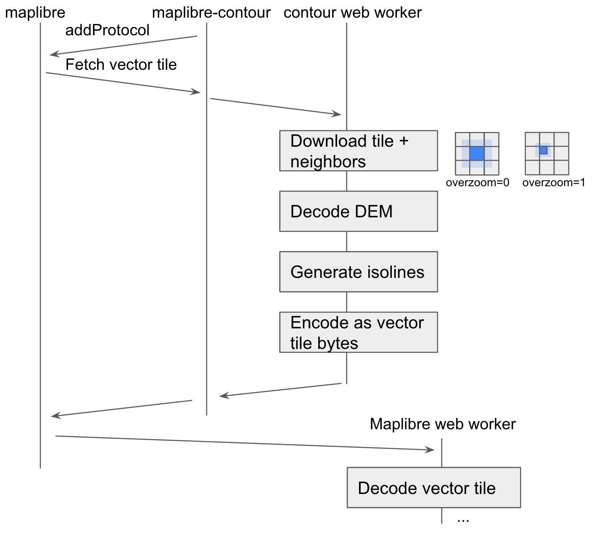

# maplibre-contour-pmtiles

maplibre-contour-pmtiles is a plugin to render contour lines in [MapLibre GL JS](https://github.com/maplibre/maplibre-gl-js) from `raster-dem` pmtiles sources. It was forked to support pmtiles with http support on the web and http and local supoort in node.js.


[Live example #1 (Just Terrain)](https://acalcutt.github.io/maplibre-contour-pmtiles/) | [Code](https://github.com/acalcutt/maplibre-contour-pmtiles/blob/pages/index.html)  
[Live example #2 (w/ OpenMapTiles Style)](https://acalcutt.github.io/maplibre-contour-pmtiles/omt.html) | [Code](https://github.com/acalcutt/maplibre-contour-pmtiles/blob/pages/omt.html)  | [Style](https://acalcutt.github.io/maplibre-contour-pmtiles/styles/osm-bright-gl-style/style.json) 

To use it, import the [@acalcutt/maplibre-contour-pmtiles](https://www.npmjs.com/package/@acalcutt/maplibre-contour-pmtiles) package with a script tag:

```html
<script src="https://unpkg.com/@acalcutt/maplibre-contour-pmtiles@0.0.1/dist/maplibre-contour-pmtiles.min.js"></script>
```

Or as an ES6 module: `npm add @acalcutt/maplibre-contour-pmtiles`

```js
import mlcontour from "@acalcutt/maplibre-contour-pmtiles";
```

Then to use, first create a `DemSource` and register it with maplibre:

```js
var demSource = new mlcontour.DemSource({
  url: "https://url/of/dem/source.pmtiles",
  encoding: "terrarium", // "mapbox" or "terrarium" default="terrarium"
  maxzoom: 13,
  worker: true, // offload isoline computation to a web worker to reduce jank
  cacheSize: 100, // number of most-recent tiles to cache
  timeoutMs: 10_000, // timeout on fetch requests
});
demSource.setupMaplibre(maplibregl);
```

Then configure a new contour source and add it to your map:

```js
map.addSource("contour-source", {
  type: "vector",
  tiles: [
    demSource.contourProtocolUrl({
      // convert meters to feet, default=1 for meters
      multiplier: 3.28084,
      thresholds: {
        // zoom: [minor, major]
        11: [200, 1000],
        12: [100, 500],
        14: [50, 200],
        15: [20, 100],
      },
      // optional, override vector tile parameters:
      contourLayer: "contours",
      elevationKey: "ele",
      levelKey: "level",
      extent: 4096,
      buffer: 1,
    }),
  ],
  maxzoom: 15,
});
```

Then add contour line and label layers:

```js
map.addLayer({
  id: "contour-lines",
  type: "line",
  source: "contour-source",
  "source-layer": "contours",
  paint: {
    "line-color": "rgba(0,0,0, 50%)",
    // level = highest index in thresholds array the elevation is a multiple of
    "line-width": ["match", ["get", "level"], 1, 1, 0.5],
  },
});
map.addLayer({
  id: "contour-labels",
  type: "symbol",
  source: "contour-source",
  "source-layer": "contours",
  filter: [">", ["get", "level"], 0],
  layout: {
    "symbol-placement": "line",
    "text-size": 10,
    "text-field": ["concat", ["number-format", ["get", "ele"], {}], "'"],
    "text-font": ["Noto Sans Bold"],
  },
  paint: {
    "text-halo-color": "white",
    "text-halo-width": 1,
  },
});
```

You can also share the cached tiles with other maplibre sources that need elevation data:

```js
map.addSource("dem", {
  type: "raster-dem",
  encoding: "terrarium",
  tiles: [demSource.sharedDemProtocolUrl],
  maxzoom: 13,
  tileSize: 256,
});
```

# How it works



[`DemSource.setupMaplibre`](./src/dem-source.ts) uses MapLibre's [`addProtocol`](https://maplibre.org/maplibre-gl-js-docs/api/properties/#addprotocol) utility to register a callback to provide vector tile for the contours source. Each time maplibre requests a vector tile:

- [`DemManager`](./src/dem-manager.ts) fetches (and caches) the raster-dem image tile and its neighbors so that contours are continuous across tile boundaries.
  - When `DemSource` is configured with `worker: true`, it uses [`RemoteDemManager`](./src/remote-dem-manager.ts) to spawn [`worker.ts`](./src/worker.ts) in a web worker. The web worker runs [`LocalDemManager`](./src/dem-manager.ts) locally and uses the [`Actor`](./src/actor.ts) utility to send cancelable requests and responses between the main and worker thread.
- [`decode-image.ts`](./src/decode-image.ts) decodes the raster-dem image RGB values to meters above sea level for each pixel in the tile.
- [`HeightTile`](./src/height-tile.ts) stitches those raw DEM tiles into a "virtual tile" that contains the border of neighboring tiles, aligns elevation measurements to the tile grid, and smooths the elevation measurements.
- [`isoline.ts`](./src/isolines.ts) generates contour isolines from a `HeightTile` using a marching-squares implementation derived from [d3-contour](https://github.com/d3/d3-contour).
- [`vtpbf.ts`](./src/vtpbf.ts) encodes the contour isolines as mapbox vector tile bytes.

MapLibre sends that vector tile to its own worker, decodes it, and renders as if it had been generated by a server.

# Why?

There are a lot of parameters you can tweak when generating contour lines from elevation data like units, thresholds, and smoothing parameters. Pre-generated contour vector tiles require 100+gb of storage for each variation you want to generate and host. Generating them on-the-fly in the browser gives infinite control over the variations you can use on a map from the same source of raw elevation data that maplibre uses to render hillshade.

# License

maplibre-contour-pmtiles is licensed under the [BSD 3-Clause License](LICENSE). It includes code adapted from:

- [d3-contour](https://github.com/d3/d3-contour) (ISC license)
- [vt-pbf](https://github.com/mapbox/vt-pbf) (MIT license)
- [PMTiles](https://github.com/protomaps/PMTiles) (BSD 3-Clause license)
